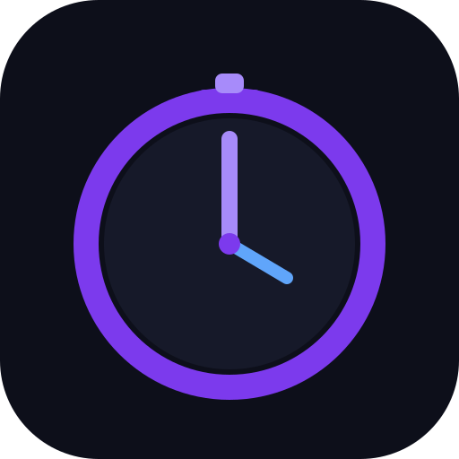

<p align="center"></p>
<h1 align="center">CountDown · لحظه‌های خوب در راه‌اند</h1>
<p align="center">شمارش معکوس فارسی با تقویم شمسی؛ سبک، خصوصی و آفلاین.<br />A small, offline-first Persian countdown. No framework, backend or tracking.</p>
<p align="center"><a href="https://karoangus.github.io/Countdown/">اجرای برنامه</a> · <a href="#english">English</a> · <a href="CHANGELOG.md">تغییرات نسخهٔ ۲</a></p>

<p align="center"></p>

<div dir="rtl">

## چه چیزهایی تازه است؟

- **داشبورد تازه:** تعداد تایمرهای فعال و رسیده، نزدیک‌ترین رویداد، تم روشن/تیره با پیروی از تنظیمات دستگاه.
- **مدیریت راحت‌تر:** جست‌وجوی فارسی با یکسان‌سازی «ی/ي»، «ک/ك» و اعداد؛ فیلتر وضعیت و مرتب‌سازی بر اساس زمان یا عنوان.
- **حذف قابل بازگشت:** دکمهٔ «برگردوندن» تا زمان بستن پیام یا انجام عملیات بعدی در دسترس می‌ماند.
- **پشتیبان JSON:** دریافت فایل و بازیابی بدون حذف تایمرهای فعلی؛ شناسه‌های تکراری نادیده گرفته می‌شوند و دادهٔ موجود اولویت دارد.
- **تقویم بهتر:** انتخاب مستقیم ماه/سال، رفتن به امروز و میان‌بر یک ساعت، فردا و یک هفته؛ ورق زدن تقویم تاریخ انتخاب‌شده را عوض نمی‌کند.
- **ورودی دقیق:** پذیرش اعداد فارسی، عربی و انگلیسی، اعتبارسنجی ساعت و تاریخ، پشتیبانی از ایموجی‌های ترکیبی.
- **دسترس‌پذیری:** دیالوگ بومی مرورگر، کنترل با صفحه‌کلید، بازگرداندن فوکوس، برچسب‌های خوانا و رعایت کاهش حرکت.
- **ذخیره‌سازی مطمئن‌تر:** مهاجرت بدون تغییر کلید `cd_timers`، همگام‌سازی پنجره‌ها و جلوگیری از ذخیرهٔ ویرایش قدیمی پس از تغییر در پنجرهٔ دیگر.

## سبک و روان، نه فقط زیباتر

هیچ فریم‌ورک یا کتابخانه‌ای به اجرای برنامه اضافه نشده است. شمارنده در هر تیک فقط متن عددهای تغییرکرده را عوض می‌کند، نه HTML کارت را. با پنهان شدن صفحه یا پایان همهٔ تایمرها، حلقهٔ شمارش متوقف می‌شود و هنگام بازگشت با ساعت واقعی دستگاه همگام می‌شود. انیمیشن دائمی و لایه‌های محو سنگین حذف شده‌اند.

مجموع فایل‌های متنی اجرای برنامه (HTML، CSS، JS و مانیفست) در نسخهٔ ۲ حدود **۲۰٫۴ KiB با gzip** است؛ تست خودکار اجازه نمی‌دهد از **۲۴ KiB** بیشتر شود. فونت‌های محلی و آیکون‌ها جدا از این عدد هستند. دادهٔ نمونه، فونت ایموجی اضافه و تصویر داشبورد در اجرای برنامه بارگیری نمی‌شوند.

## شروع سریع

</div>

```bash
git clone https://github.com/karoangus/Countdown.git
cd Countdown
python3 -m http.server 8080 --bind 0.0.0.0
# http://localhost:8080
```

<div dir="rtl">

برای اجرای برنامه **npm، بیلد یا سرور اختصاصی لازم نیست**. فقط برای توسعه و تست‌های مرورگری از npm استفاده می‌شود. مرورگرهای جدید دارای `Intl` با تقویم Persian و `dialog` (مانند Chrome/Edge، Firefox و Safari 15.4+) مورد نیازند. اجرای مستقیم فایل HTML ممکن است، ولی ذخیره‌سازی در `file://` بین مرورگرها یکسان نیست؛ استفاده از وب‌سرور توصیه می‌شود.

## ساخت اولین لحظه

۱. روی «تایمر جدید» بزن، عنوان و در صورت تمایل ایموجی و رنگ را انتخاب کن.<br />
۲. از میان‌برها یا تقویم شمسی استفاده کن؛ ساعت بر اساس **منطقهٔ زمانی دستگاه** است.<br />
۳. تایمر را بساز. تاریخ گذشته مجاز است و به‌صورت «وقتش رسید!» نمایش داده می‌شود.

جابجایی دستی کارت‌ها در حالت «همه / ترتیب دلخواه / بدون جست‌وجو» فعال است. ترتیب مرتب‌سازی‌شدهٔ نمایشی، ترتیب اصلی ذخیره‌شده را تغییر نمی‌دهد.

<p align="center"> </p>

## اطلاعاتت کجا می‌ماند؟

فقط در `localStorage` همین مرورگر؛ نه حساب کاربری، نه سرور، نه رهگیری. **پاک کردن دادهٔ سایت یا مرورگر، تایمرها را حذف می‌کند**؛ گاهی از «پشتیبان‌گیری» استفاده کن. فایل پشتیبان رمزنگاری نشده است، پس آن را خصوصی نگه دار.

- حداکثر ۱۰۰۰ تایمر، عنوان ۶۰ کاراکتری، فایل ورودی حداکثر ۲ MiB.
- بازهٔ رویدادها: سال‌های میلادی ۱۹۰۱ تا پایان ۲۱۹۹؛ داده‌های قدیمی سالم حفظ می‌شوند.
- فایل خراب یا رکورد نامعتبر در زمان اجرا خودکار بازنویسی نمی‌شود؛ تایمرهای سالم نمایش داده می‌شوند و هشدار بازیابی ظاهر می‌شود.
- در صورت خرابی، ابتدا «دریافت دادهٔ خام» و سپس در صورت اطمینان «شروع دوباره» را انتخاب کن. شروع دوباره فقط تایمرهای سالمِ نمایش‌داده‌شده را نگه می‌دارد.
- در خطای فضای ذخیره‌سازی، فرم باز می‌ماند و موفقیت کاذب نمایش داده نمی‌شود.
- همگام‌سازی بین پنجره‌های همین مرورگر است، نه بین دستگاه‌ها. ذخیره‌های دقیقاً هم‌زمان در چند پنجره تضمین تراکنش پایگاه داده ندارند.

## تقویم و ساعت

تبدیل تاریخ از تقویم استاندارد Persian در `Intl.DateTimeFormat` مرورگر (ICU) استفاده می‌کند؛ بدون الگوریتم تقریبی ۲۸۲۰ ساله یا وصلهٔ ویژهٔ ۱۴۰۴. تبدیل روزهای مدنی در UTC انجام می‌شود و زمان رویداد عمداً محلی است. ساعت ناموجود هنگام تغییر ساعت تابستانی رد می‌شود. تاریخ‌های بسیار دور ممکن است تابع نسخهٔ داده‌های تقویمی مرورگر باشند؛ مرجع پیش‌بینی نجومی نیستند.

تایمر به‌صورت timestamp ذخیره می‌شود؛ تغییر منطقهٔ زمانی، لحظهٔ هدف را تغییر نمی‌دهد ولی ساعت نمایش‌داده‌شده محلی می‌شود. شمارش به ساعت دستگاه وابسته است؛ این برنامه زنگ هشدار یا اعلان پس‌زمینه نیست.

## نصب و استفادهٔ آفلاین

پس از اولین بارگذاری موفق روی HTTPS (یا localhost)، فایل‌ها و فونت‌ها برای اجرای آفلاین ذخیره می‌شوند. در Android/Chrome از «Install app»، در iOS از «Share → Add to Home Screen» و در دسکتاپ از دکمهٔ نصب مرورگر استفاده کن.

نسخهٔ جدید Service Worker پس از بسته شدن همهٔ پنجره‌های نسخهٔ قبلی فعال می‌شود تا فرم باز، وسط کار تغییر نسخه ندهد. اگر نسخهٔ قدیمی را می‌بینی، با اینترنت برنامه را باز کن، همهٔ پنجره‌های آن را ببند و دوباره اجرا کن. کش سایر برنامه‌های روی همان دامنه پاک نمی‌شود.

<p align="center"></p>

## تست و توسعه

</div>

```bash
npm ci
npm test                         # Node: core, calendar, time zones, size budget
npx playwright install --with-deps chromium
npm run test:e2e                  # Desktop + mobile emulation, offline, axe
npm run test:all
```

<div dir="rtl">

GitHub Actions همین تست‌ها را برای پول‌ریکوست‌ها اجرا می‌کند. مجموعه شامل ۱۶ تست منطق/تقویم/حجم و ۳۴ سناریوی مرورگری (۱۷ سناریو در دو نمای دسکتاپ و موبایل) است. تبدیل رفت‌وبرگشت **همهٔ روزهای ۱۹۰۱ تا ۲۱۹۹**، کبیسه، مرز انقضا، دادهٔ خراب، خطای ذخیره، تزریق HTML، بازیابی، چند پنجره، آفلاین، ۱۰۰ تایمر، صفحهٔ ۳۲۰ پیکسلی و بررسی axe در هر دو تم پوشش داده شده‌اند. تست موبایل شبیه‌سازی در Chromium است، نه ادعای آزمون روی همهٔ گوشی‌ها یا Safari واقعی.

</div>

## English

CountDown v2 is an offline-first Persian countdown PWA with **zero runtime dependencies** and no build step. It adds a responsive light/dark dashboard, search/filter/sort, undo deletion, validated non-destructive JSON backup import/export, keyboard-friendly native dialogs and a better Jalali picker.

- Calendar: native Persian `Intl`/ICU, UTC civil-date conversion, local wall-clock event times.
- Persistence: existing `cd_timers` format remains compatible. Invalid storage is never overwritten on startup; failed writes preserve the editor. Cross-tab sync detects stale edits (not an atomic multi-tab database).
- Performance: cached DOM references, changed-number-only ticks, no background ticking, no perpetual animations. A 24 KiB gzip budget covers shipped HTML/CSS/JS/manifest, excluding local fonts/icons.
- Offline: versioned app-shell cache, scoped cleanup, query-string navigation fallback; updates activate after old tabs close.
- Limits: 1,000 timers, 2 MiB backup input, target dates in 1901–2199. No background alarms or push notifications.
- Tests: Node built-ins + development-only Playwright/axe; CI covers desktop and mobile emulation. Screenshots use sample data and a capture-only monochrome emoji font; the app uses native system emoji.

### Files

| File | Purpose |
| --- | --- |
| `index.html`, `style.css` | Semantic RTL interface, responsive themes |
| `app.js` | UI, persistence, timer scheduling, dialogs and backup |
| `timer-core.js` | Pure validation, countdown, import and search helpers |
| `persian-cal.js` | Persian ↔ Gregorian date conversion |
| `theme.js` | Apply saved theme before first paint |
| `sw.js`, `manifest.json` | Offline app shell and installation |
| `tests/` | Node and browser regression tests |

Run `python3 -m http.server 8080 --bind 0.0.0.0` and open `http://localhost:8080`. npm packages are for tests only; they are never shipped to users.

When changing shipped assets, bump the cache version in `sw.js` so existing installations receive a consistent new app shell.
