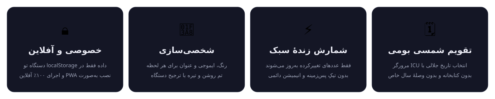

<p align="center"></p>

<h1 align="center">CountDown · لحظه‌های خوب در راه‌اند</h1>
<p align="center">شمارش معکوس فارسی با تقویم شمسی؛ سبک، خصوصی و آفلاین.<br />A small, offline-first Persian countdown PWA. No framework, no backend, no tracking.</p>

<p align="center">
  <a href="https://github.com/karoangus/Countdown/actions/workflows/test.yml"></a>
  <a href="CHANGELOG.md"></a>
  <a href="LICENSE"></a>
  <a href="#سبک-و-روان-نه-فقط-زیباتر"></a>
  <a href="#english"></a>
  <a href="#نصب-و-استفادهٔ-آفلاین"></a>
</p>

<p align="center"><a href="https://karoangus.github.io/Countdown/">اجرای برنامه</a> · <a href="#فهرست">فهرست</a> · <a href="#english">English</a> · <a href="CHANGELOG.md">تغییرات نسخهٔ ۲</a></p>

<p align="center"></p>

<p align="center"></p>

<div dir="rtl">

## فهرست

- [چه چیزهایی تازه است؟](#چه-چیزهایی-تازه-است)
- [سبک و روان، نه فقط زیباتر](#سبک-و-روان-نه-فقط-زیباتر)
- [شروع سریع](#شروع-سریع)
- [ساخت اولین لحظه](#ساخت-اولین-لحظه)
- [داشبورد، جست‌وجو و مدیریت](#داشبورد-جستوجو-و-مدیریت)
- [کیبورد و دسترس‌پذیری](#کیبورد-و-دسترسپذیری)
- [اطلاعاتت کجا می‌ماند؟](#اطلاعاتت-کجا-میماند)
- [قالب فایل پشتیبان](#قالب-فایل-پشتیبان)
- [تقویم و ساعت](#تقویم-و-ساعت)
- [نصب و استفادهٔ آفلاین](#نصب-و-استفادهٔ-آفلاین)
- [مرورگرهای پشتیبانی‌شده](#مرورگرهای-پشتیبانیشده)
- [عیب‌یابی](#عیبیابی)
- [تست و توسعه](#تست-و-توسعه)
- [ساختار پروژه](#ساختار-پروژه)
- [مشارکت](#مشارکت)
- [لایسنس و یادکرد](#لایسنس-و-یادکرد)

## چه چیزهایی تازه است؟

نسخهٔ **۲٫۰٫۰** (۲۰۲۶-۰۹-۱۹) یک بازسازی کامل است؛ فهرست کامل در [CHANGELOG](CHANGELOG.md).

- **داشبورد تازه:** تعداد تایمرهای فعال و رسیده، نزدیک‌ترین رویداد، تاریخ امروز به شمسی، تم روشن/تیره با پیروی از تنظیمات دستگاه.
- **مدیریت راحت‌تر:** جست‌وجوی فارسی با یکسان‌سازی «ی/ي»، «ک/ك»، نیم‌فاصله و اعداد؛ فیلتر وضعیت (همه/در حال شمارش/رسیده‌ها) و مرتب‌سازی بر اساس نزدیک‌ترین، دورترین یا عنوان.
- **حذف قابل بازگشت:** دکمهٔ «برگردوندن» تا زمان بستن پیام یا انجام عملیات بعدی در دسترس می‌ماند.
- **پشتیبان JSON:** دریافت فایل و بازیابی بدون حذف تایمرهای فعلی؛ شناسه‌های تکراری نادیده گرفته می‌شوند و دادهٔ موجود اولویت دارد.
- **تقویم بهتر:** انتخاب مستقیم ماه/سال (۱۲۷۹ تا ۱۵۷۸ شمسی)، رفتن به امروز و میان‌بر یک ساعت، فردا و یک هفته؛ ورق زدن تقویم تاریخ انتخاب‌شده را عوض نمی‌کند.
- **ورودی دقیق:** پذیرش اعداد فارسی، عربی و انگلیسی، اعتبارسنجی ساعت و تاریخ، پشتیبانی از ایموجی‌های ترکیبی.
- **دسترس‌پذیری:** دیالوگ بومی مرورگر، کنترل با صفحه‌کلید، بازگرداندن فوکوس، برچسب‌های خوانا و رعایت کاهش حرکت.
- **ذخیره‌سازی مطمئن‌تر:** مهاجرت بدون تغییر کلید `cd_timers`، همگام‌سازی پنجره‌ها و جلوگیری از ذخیرهٔ ویرایش قدیمی پس از تغییر در پنجرهٔ دیگر.

## سبک و روان، نه فقط زیباتر

هیچ فریم‌ورک یا کتابخانه‌ای به اجرای برنامه اضافه نشده است. شمارنده در هر تیک فقط متن عددهای تغییرکرده را عوض می‌کند، نه HTML کارت را. با پنهان شدن صفحه یا پایان همهٔ تایمرها، حلقهٔ شمارش متوقف می‌شود و هنگام بازگشت با ساعت واقعی دستگاه همگام می‌شود. انیمیشن دائمی و لایه‌های محو سنگین حذف شده‌اند.

مجموع فایل‌های متنی اجرای برنامه (HTML، CSS، JS و مانیفست) در نسخهٔ ۲ حدود **۲۰٫۴ KiB با gzip** است؛ تست خودکار اجازه نمی‌دهد از **۲۴ KiB** بیشتر شود. فونت‌های محلی و آیکون‌ها جدا از این عدد هستند. دادهٔ نمونه، فونت ایموجی اضافه و تصویر داشبورد در اجرای برنامه بارگیری نمی‌شوند.

## شروع سریع

</div>

```bash
git clone https://github.com/karoangus/Countdown.git
cd Countdown
python3 -m http.server 8080 --bind 0.0.0.0
# http://localhost:8080
```

<div dir="rtl">

برای اجرای برنامه **npm، بیلد یا سرور اختصاصی لازم نیست**. npm فقط برای توسعه و تست‌ها استفاده می‌شود. اجرای مستقیم فایل HTML هم ممکن است، ولی ذخیره‌سازی در `file://` بین مرورگرها یکسان نیست؛ استفاده از وب‌سرور توصیه می‌شود.

نسخهٔ زندهٔ عمومی هم روی GitHub Pages در دسترس است: [karoangus.github.io/Countdown](https://karoangus.github.io/Countdown/)

## ساخت اولین لحظه

۱. روی «تایمر جدید» بزن، عنوان و در صورت تمایل ایموجی و رنگ را انتخاب کن.<br />
۲. از میان‌برها (یک ساعت دیگه / فردا همین موقع / یک هفته دیگه) یا تقویم شمسی استفاده کن؛ ساعت بر اساس **منطقهٔ زمانی دستگاه** است.<br />
۳. تایمر را بساز. تاریخ گذشته مجاز است و به‌صورت «وقتش رسید!» نمایش داده می‌شود.

جابجایی دستی کارت‌ها با دکمه‌های ↑/↓ در حالت «همه / ترتیب دلخواه / بدون جست‌وجو» فعال است. ترتیب مرتب‌سازی‌شدهٔ نمایشی، ترتیب اصلی ذخیره‌شده را تغییر نمی‌دهد.

<p align="center"> </p>

## داشبورد، جست‌وجو و مدیریت

- **خلاصهٔ زنده:** شمار «در حال شمارش» و «به لحظه‌ش رسیده» و نزدیک‌ترین لحظه با تاریخ شمسی و ساعت محلی.
- **فیلتر وضعیت:** همه / در حال شمارش / رسیده‌ها.
- **جست‌وجوی منعطف:** «كيك» همان «کیک» را پیدا می‌کند؛ اعداد فارسی/عربی/انگلیسی یکسان می‌شوند و نیم‌فاصله نادیده گرفته می‌شود.
- **مرتب‌سازی:** ترتیب دلخواه (پیش‌فرض)، نزدیک‌ترین، دورترین، عنوان (مقایسهٔ فارسی).
- **پشتیبان‌گیری/بازیابی** در بالای بخش «لحظه‌های من»؛ بازیابی هیچ تایمر فعلی را حذف نمی‌کند.

## کیبورد و دسترس‌پذیری

| کلید / رفتار | نتیجه |
| --- | --- |
| `Tab` / `Shift+Tab` در دیالوگ | فوکوس داخل پنجره می‌ماند و به نوار مرورگر نمی‌رود |
| `Escape` | بستن دیالوگ و بازگشت فوکوس به دکمهٔ فراخوان |
| `Enter` در فرم | ثبت تایمر (معادل دکمهٔ «ساخت تایمر») |
| پیوند «رفتن به محتوا» | پرش از سربرگ به محتوای اصلی برای کاربران کیبورد/صفحه‌خوان |
| دکمه‌های ↑ ↓ ✎ × روی هر کارت | جابجایی، ویرایش و حذف کاملاً با کیبورد قابل دسترسی‌اند |

دیالوگ با `<dialog>` بومی ساخته شده، پس focus trap و بستن با Escape واقعی است. پس از حذف هر تایمر، فوکوس به دکمهٔ «تایمر جدید» برمی‌گردد تا جریان کیبورد گم نشود. در صورت فعال بودن «کاهش حرکت» در سیستم‌عامل، انیمیشن‌ها خاموش می‌شوند. بررسی خودکار axe در هر دو تم روشن و تیره اجرا می‌شود.

## اطلاعاتت کجا می‌ماند؟

فقط در `localStorage` همین مرورگر؛ نه حساب کاربری، نه سرور، نه رهگیری. دو کلید استفاده می‌شود:

- `cd_timers` — آرایهٔ JSON تایمرها (همان کلید نسخهٔ ۱؛ مهاجرت بدون تغییر).
- `cd_theme` — ترجیح پوسته (`light` یا `dark`)؛ بدون آن، ترجیح دستگاه اعمال می‌شود.

**پاک کردن دادهٔ سایت یا مرورگر، تایمرها را حذف می‌کند**؛ گاهی از «پشتیبان‌گیری» استفاده کن. فایل پشتیبان رمزنگاری نشده است، پس آن را خصوصی نگه دار.

- حداکثر ۱۰۰۰ تایمر، عنوان ۶۰ کاراکتری، ایموجی تا ۳۲ کدپوینت (پیش‌فرض ✨)، فایل ورودی حداکثر ۲ MiB.
- بازهٔ رویدادها: سال‌های میلادی ۱۹۰۱ تا پایان ۲۱۹۹؛ داده‌های قدیمی سالم حفظ می‌شوند.
- رنگ هر تایمر از یک فهرست ثابت ۸ رنگ انتخاب می‌شود؛ مقدار دلخواه پذیرفته نمی‌شود.
- فایل خراب یا رکورد نامعتبر در زمان اجرا خودکار بازنویسی نمی‌شود؛ تایمرهای سالم نمایش داده می‌شوند و هشدار بازیابی ظاهر می‌شود.
- در صورت خرابی، ابتدا «دریافت دادهٔ خام» و سپس در صورت اطمینان «شروع دوباره» را انتخاب کن. شروع دوباره فقط تایمرهای سالمِ نمایش‌داده‌شده را نگه می‌دارد.
- در خطای فضای ذخیره‌سازی، فرم باز می‌ماند و موفقیت کاذب نمایش داده نمی‌شود.
- همگام‌سازی بین پنجره‌های همین مرورگر است، نه بین دستگاه‌ها. ذخیره‌های دقیقاً هم‌زمان در چند پنجره تضمین تراکنش پایگاه داده ندارند.

## قالب فایل پشتیبان

خروجی «پشتیبان‌گیری» یک JSON خوانا با این شکل است:

```json
{
  "version": 1,
  "exportedAt": "2026-09-24T12:00:00.000Z",
  "timers": [
    {
      "id": "f3a1c2",
      "title": "سفر به شمال",
      "emoji": "🌊",
      "color": "#2563eb",
      "targetMs": 1790000000000
    }
  ]
}
```

- `id`: رشتهٔ `[a-zA-Z0-9_-]` تا ۱۰۰ نویسه؛ شناسه‌های تزریقی یا تکراری رد می‌شوند.
- `targetMs`: timestamp میلی‌ثانیه‌ای لحظهٔ هدف در بازهٔ ۱۹۰۱ تا ۲۱۹۹ میلادی.
- آرایهٔ سادهٔ تایمرها (قالب قدیمی نسخهٔ ۱) هم هنگام بازیابی پذیرفته می‌شود.
- بازیابی افزایشی است: فقط شناسه‌های جدید اضافه می‌شوند و تایمر موجود بر وارداتی با همان `id` اولویت دارد؛ مجموع از ۱۰۰۰ تایمر بیشتر نمی‌شود.

## تقویم و ساعت

تبدیل تاریخ از تقویم استاندارد Persian در `Intl.DateTimeFormat` مرورگر (ICU) استفاده می‌کند؛ بدون الگوریتم تقریبی یا وصلهٔ ویژهٔ یک سال خاص. تبدیل روزهای مدنی در UTC انجام می‌شود و زمان رویداد عمداً محلی است. ساعت ناموجود هنگام تغییر ساعت تابستانی رد می‌شود. تاریخ‌های بسیار دور ممکن است تابع نسخهٔ داده‌های تقویمی مرورگر باشند؛ مرجع پیش‌بینی نجومی نیستند.

تایمر به‌صورت timestamp ذخیره می‌شود؛ تغییر منطقهٔ زمانی، لحظهٔ هدف را تغییر نمی‌دهد ولی ساعت نمایش‌داده‌شده محلی می‌شود. شمارش به ساعت دستگاه وابسته است؛ این برنامه زنگ هشدار یا اعلان پس‌زمینه نیست.

## نصب و استفادهٔ آفلاین

پس از اولین بارگذاری موفق روی HTTPS (یا localhost)، فایل‌ها و فونت‌ها برای اجرای آفلاین ذخیره می‌شوند. در Android/Chrome از «Install app»، در iOS از «Share → Add to Home Screen» و در دسکتاپ از دکمهٔ نصب مرورگر استفاده کن.

نسخهٔ جدید Service Worker پس از بسته شدن همهٔ پنجره‌های نسخهٔ قبلی فعال می‌شود تا فرم باز، وسط کار تغییر نسخه ندهد. اگر نسخهٔ قدیمی را می‌بینی، با اینترنت برنامه را باز کن، همهٔ پنجره‌های آن را ببند و دوباره اجرا کن. کش سایر برنامه‌های روی همان دامنه پاک نمی‌شود.

<p align="center"></p>

## مرورگرهای پشتیبانی‌شده

| مرورگر | وضعیت | نکته |
| --- | --- | --- |
| Chrome / Edge (دسکتاپ و Android) | ✅ کامل | دیالوگ بومی و تقویم Persian در `Intl` |
| Firefox | ✅ کامل | نسخهٔ ۹۸ به بعد (دیالوگ بومی) |
| Safari (macOS / iOS) | ✅ کامل | نسخهٔ ۱۵٫۴ به بعد (دیالوگ بومی) |
| مرورگرهای بدون `<dialog>` بومی | ❌ | فرم باز نمی‌شود |

نصب به‌صورت PWA و اجرای آفلاین به Service Worker نیاز دارد که فقط روی HTTPS یا localhost فعال می‌شود.

## عیب‌یابی

- **نسخهٔ قدیمی می‌بینم:** با اینترنت باز کن، همهٔ پنجره‌های برنامه را ببند و دوباره باز کن تا Service Worker جدید فعال شود.
- **پیام «ذخیره‌سازی در دسترس نیست»:** معمولاً یعنی حالت خصوصی/مسدود بودن `localStorage`. با «دریافت دادهٔ خام» یک کپی بگیر و اجازهٔ ذخیره‌سازی مرورگر را بررسی کن.
- **با دابل‌کلیک روی فایل کار نمی‌کند:** در `file://` برخی مرورگرها `localStorage` یا Service Worker را محدود می‌کنند؛ از `python3 -m http.server` استفاده کن.
- **ساعت رویداد بعد از سفر عوض شد:** لحظهٔ هدف ثابت است؛ فقط نمایش به ساعت محلی جدید ترجمه می‌شود.
- **صدا/اعلانی نمی‌شنوم:** این برنامه عامداً سرویس هشدار پس‌زمینه نیست؛ شمارش فقط تا وقتی صفحه باز است جریان دارد.

## تست و توسعه

</div>

```bash
npm ci
npm test                         # Node: core, calendar, time zones, size budget
npx playwright install --with-deps chromium
npm run test:e2e                  # Desktop + mobile emulation, offline, axe
npm run test:all
```

<div dir="rtl">

GitHub Actions (ورک‌فلوی `Tests`) همین تست‌ها را برای پول‌ریکوست‌ها و push به `main` اجرا می‌کند. مجموعه شامل موارد زیر است:

- **۱۶ تست Node:** ۹ تست منطق/نرمال‌سازی/پشتیبان، ۶ تست تقویم/منطقهٔ زمانی و ۱ تست بودجهٔ حجم.
- **۳۴ سناریوی مرورگری:** ۱۷ سناریو در دو نمای دسکتاپ (Chrome) و موبایل (شبیه‌سازی iPhone 13 روی Chromium).
- تبدیل رفت‌وبرگشت **همهٔ روزهای ۱۹۰۱ تا ۲۱۹۹**، کبیسه، مرز انقضا، دادهٔ خراب، خطای ذخیره، تزریق HTML، بازیابی، چند پنجره، آفلاین، ۱۰۰ تایمر، صفحهٔ ۳۲۰ پیکسلی و بررسی axe در هر دو تم.

تست موبایل شبیه‌سازی در Chromium است، نه ادعای آزمون روی همهٔ گوشی‌ها یا Safari واقعی.

شیوهٔ کد: تنظیمات Prettier در `.prettierrc.json` است (single quote، عرض ۱۰۰، بدون ویرگول انتهایی). Prettier عمداً در وابستگی‌ها نیست؛ اگر ویرایشگرت آن را می‌خواند همان کافی است. CI با Node 22 اجرا می‌شود.

## ساختار پروژه

| مسیر | نقش |
| --- | --- |
| `index.html` | رابط RTL و نشانه‌گذاری دسترس‌پذیر |
| `style.css` | تم روشن/تیره، واکنش‌گرا، کاهش حرکت |
| `app.js` | UI، ذخیره‌سازی تراکنشی، زمان‌بندی تیک، دیالوگ و پشتیبان |
| `timer-core.js` | توابع خالص اعتبارسنجی/شمارش/جست‌وجو/ادغام (بدون DOM) |
| `persian-cal.js` | تبدیل شمسی↔میلادی با ICU مرورگر |
| `theme.js` | اعمال پوسته پیش از اولین paint |
| `sw.js` | سرویس‌ورکر آفلاین با پاک‌سازی محدود به پیشوند خود |
| `manifest.json` | هویت PWA و آیکون‌ها |
| `fonts/` | زیرمجموعهٔ فونت Vazirmatn به‌همراه رونوشت لایسنس (`OFL.txt`) |
| `docs/screenshots/` | تصاویر همین README |
| `tests/` | تست‌های Node و Playwright |
| `.github/` | قالب‌های issue و ورک‌فلوی CI |
| `playwright.config.cjs` | دو پروژهٔ دسکتاپ/موبایل و وب‌سرور محلی |

## مشارکت

ایراد، ایده و سؤال‌ها از طریق [قالب‌های issue](../../issues/new/choose) خوش‌آمدند؛ فارسی یا انگلیسی بنویس، هر کدام راحت‌تری. پیش از ثبت ایراد، [نسخهٔ زنده](https://karoangus.github.io/Countdown/) را امتحان کن و بخش «عیب‌یابی» را ببین. برای پول‌ریکوست: شاخه بساز، تست‌ها (`npm run test:all`) را سبز نگه دار و بودجهٔ ۲۴ KiB را نشکن.

## لایسنس و یادکرد

- کد این پروژه تحت لایسنس **MIT** است (فایل [LICENSE](LICENSE)).
- فونت رابط، [Vazirmatn](https://github.com/rastikerdar/vazirmatn) اثر صابر راستی‌کردار و نویسندگان پروژهٔ وزیرمتن است و تحت **SIL Open Font License 1.1** توزیع می‌شود؛ فایل‌های `fonts/` زیرمجموعهٔ بدون تغییر همین فونت‌اند و رونوشت لایسنس آن‌ها در `fonts/OFL.txt` همراه شده است.
- تصاویر `docs/screenshots` با دادهٔ نمونه و فونت ایموجی تک‌رنگِ فقط-برای-ضبط ساخته شده‌اند؛ خود برنامه از ایموجی بومی دستگاه استفاده می‌کند.

</div>

## English

CountDown v2.0.0 is an offline-first Persian countdown PWA with **zero runtime dependencies** and no build step. It adds a responsive light/dark dashboard, search/filter/sort, undo deletion, validated non-destructive JSON backup import/export, keyboard-friendly native dialogs and a better Jalali picker.

- **Calendar:** native Persian `Intl`/ICU, UTC civil-date conversion, local wall-clock event times; no arithmetic year-specific patches.
- **Persistence:** existing `cd_timers` format remains compatible (`cd_theme` stores the theme). Invalid storage is never overwritten on startup; failed writes preserve the editor. Cross-tab sync detects stale edits (not an atomic multi-tab database).
- **Performance:** cached DOM references, changed-number-only ticks, no background ticking, no perpetual animations. A 24 KiB gzip budget covers shipped HTML/CSS/JS/manifest (currently ≈20.4 KiB), excluding local fonts/icons.
- **Offline:** versioned app-shell cache (`countdown-*` prefix), scoped cleanup, query-string navigation fallback; updates activate after old tabs close.
- **Limits:** 1,000 timers, 60-char titles, 32-code-point emoji, 2 MiB backup input, target dates in 1901–2199, 8-color allowlist. No background alarms or push notifications.
- **Tests:** Node built-ins (16) + development-only Playwright/axe (17 scenarios × desktop & mobile emulation = 34); CI runs them on pull requests and pushes to `main`. Screenshots use sample data and a capture-only monochrome emoji font; the app uses native system emoji.

### Browser support

| Browser | Support | Note |
| --- | --- | --- |
| Chrome / Edge (desktop & Android) | ✅ Full | Native `<dialog>` + ICU Persian calendar |
| Firefox | ✅ Full | 98+ (native `<dialog>`) |
| Safari (macOS / iOS) | ✅ Full | 15.4+ (native `<dialog>`) |
| Browsers without native `<dialog>` | ❌ | Editor cannot open |

PWA install and offline use need a secure context (HTTPS or localhost).

### Backup file format

`{ "version": 1, "exportedAt": ISO-string, "timers": [{ id, title, emoji, color, targetMs }] }`. Legacy plain arrays are accepted on import. Imports are additive: existing IDs win, merged totals are capped at 1,000, IDs must match `[a-zA-Z0-9_-]{1,100}` and colors come from a fixed 8-color palette.

### Files

| File | Purpose |
| --- | --- |
| `index.html`, `style.css` | Semantic RTL interface, responsive themes |
| `app.js` | UI, persistence, timer scheduling, dialogs and backup |
| `timer-core.js` | Pure validation, countdown, import and search helpers |
| `persian-cal.js` | Persian ↔ Gregorian date conversion via ICU |
| `theme.js` | Apply saved theme before first paint |
| `sw.js`, `manifest.json` | Offline app shell and installation |
| `fonts/` | Self-hosted Vazirmatn subset (SIL OFL 1.1, license copy in `fonts/OFL.txt`) |
| `tests/`, `playwright.config.cjs` | Node and browser regression tests |
| `.github/` | Issue templates and the `Tests` CI workflow |
| `docs/screenshots/` | Imagery used by this README |

Run `python3 -m http.server 8080 --bind 0.0.0.0` and open `http://localhost:8080`. npm packages are for tests only; they are never shipped to users.

When changing shipped assets, bump the cache version in `sw.js` so existing installations receive a consistent new app shell.

### License & attribution

The source code is licensed under the **MIT License** (see [`LICENSE`](LICENSE)). The bundled interface font is **Vazirmatn** by Saber Rastikerdar and the Vazirmatn Project Authors, licensed under the **SIL Open Font License 1.1** (<https://github.com/rastikerdar/vazirmatn>); `fonts/` contains unmodified subsets and a copy of the font license in `fonts/OFL.txt`.

### Contributing

Bug reports, feature ideas and questions are welcome through the repository's issue templates, in Persian or English. Try the [live demo](https://karoangus.github.io/Countdown/) and the troubleshooting section first; keep `npm run test:all` green and the 24 KiB gzip budget intact in pull requests.
