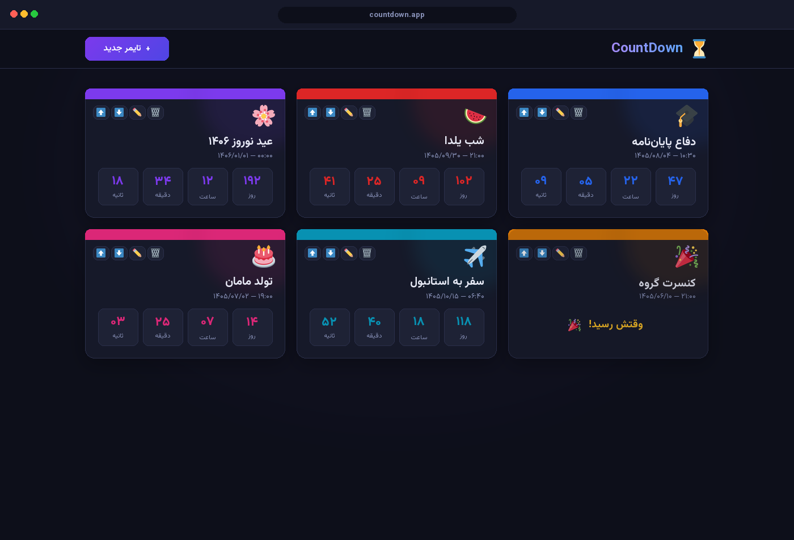
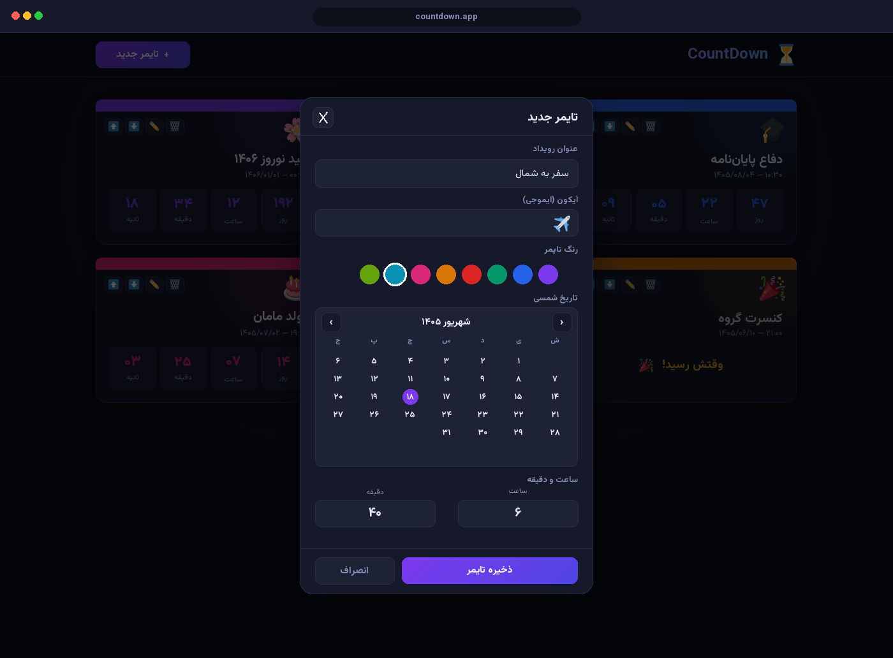
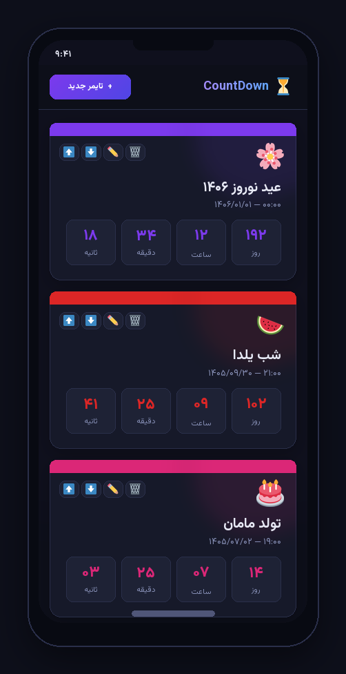
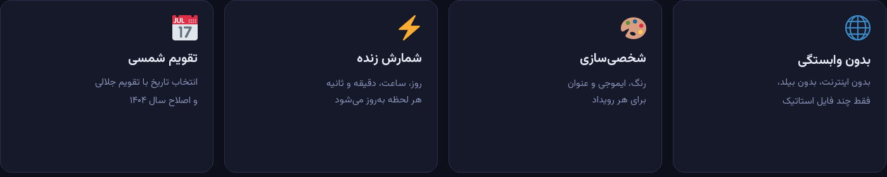

<p align="center">
  
</p>

<p align="center">
  
  
  
  
  
</p>

<p align="center">
  <b dir="rtl">شمارنده معکوس برای لحظه‌هایی که مهم‌اند — با تقویم شمسی، بدون اینترنت، بدون حساب کاربری.</b><br/>
  <i>A fully offline Jalali countdown timer. No build step, no backend, no tracking.</i>
</p>

<p align="center">
  <a href="#-پیش‌نمایش">پیش‌نمایش</a> ·
  <a href="#-قابلیت‌ها">قابلیت‌ها</a> ·
  <a href="#-شروع-سریع">شروع سریع</a> ·
  <a href="#-نصب-به‌صورت-اپ-pwa">نصب PWA</a> ·
  <a href="#english">English</a>
</p>

---

<div dir="rtl">

## پیش‌نمایش

<p align="center">
  
  <br/>
  <sub>کارت‌های شمارش معکوس با رنگ، ایموجی و تاریخ شمسی</sub>
</p>

<p align="center">
  
  <br/>
  <sub>تقویم جلالی داخلی، انتخاب رنگ و ساعت</sub>
</p>

<p align="center">
  
  &nbsp;
  
</p>

---

## قابلیت‌ها

<p align="center">
  
</p>

| | قابلیت | توضیح |
| :---: | :--- | :--- |
| 📅 | **تقویم شمسی واقعی** | انتخاب تاریخ با تقویم جلالی؛ هفته از شنبه شروع می‌شود و اسفندِ کبیسه درست محاسبه می‌شود |
| ⏱️ | **شمارش زنده** | روز، ساعت، دقیقه و ثانیه هر یک ثانیه به‌روز می‌شوند |
| 🎨 | **شخصی‌سازی** | عنوان، ایموجی و ۸ رنگ برای هر رویداد |
| 🗂️ | **چند تایمر** | ساخت، ویرایش، حذف و جابه‌جایی کارت‌ها |
| 🎉 | **رویداد رسیده‌** | وقتی زمان بگذرد، کارت به حالت «وقتش رسید!» می‌رود |
| 💾 | **ذخیرهٔ محلی** | همه چیز در `localStorage` می‌ماند؛ هیچ سروری در کار نیست |
| 📴 | **۱۰۰٪ آفلاین** | فونت وزیرمتن، آیکون‌ها و منطق برنامه کش می‌شوند |
| 📱 | **قابل نصب (PWA)** | روی موبایل و دسکتاپ مثل یک اپ واقعی نصب می‌شود |
| 🔒 | **بدون ردپا** | بدون حساب، بدون آنالیتیکس، بدون درخواست شبکه بعد از بار اول |

### جزئیات کوچک ولی مهم

- اعداد فارسی و رابط کاملاً راست‌چین
- بستن مودال با `Esc` یا کلیک روی پس‌زمینه
- مقاوم در برابر دادهٔ خراب در `localStorage`
- عنوان و ایموجی قبل از رندر HTML escape می‌شوند
- اصلاح سال ۱۴۰۴ نسبت به چرخهٔ محاسباتی ۲۸۲۰ ساله تا با تقویم رسمی ایران یکی باشد

---

## شروع سریع

برنامه وابستگی، بیلد یا سرور اختصاصی ندارد. همین فایل‌های استاتیک کافی است:

```bash
git clone https://github.com/karoangus/Countdown.git
cd Countdown
python3 -m http.server 8080
```

بعد در مرورگر باز کنید:

```
http://localhost:8080
```

> برای استفادهٔ روزمره می‌توانید `index.html` را مستقیم هم باز کنید. برای فعال شدن Service Worker و نصب PWA باید روی `http` یا `https` سرو شود.

### ساخت اولین تایمر

1. روی **تایمر جدید** بزنید
2. عنوان رویداد را بنویسید (مثلاً «عید نوروز ۱۴۰۶»)
3. یک ایموجی و رنگ انتخاب کنید
4. تاریخ شمسی و ساعت را مشخص کنید
5. **ذخیره تایمر** — شمارش از همان لحظه شروع می‌شود

---

## نصب به‌صورت اپ (PWA)

بعد از یک‌بار باز شدن، برنامه در کش مرورگر می‌ماند و بدون اینترنت کار می‌کند.

| پلتفرم | مسیر نصب |
| :--- | :--- |
| **Android / Chrome** | منوی مرورگر ← *Install app* / *Add to Home screen* |
| **iPhone / iPad** | دکمهٔ Share ← *Add to Home Screen* |
| **Desktop Chrome / Edge** | آیکون نصب در سمت راست نوار آدرس |

آیکون maskable، `apple-touch-icon` و `theme-color` تیره از قبل تنظیم شده‌اند تا روی صفحهٔ خانگی تمیز دیده شود.

---

## ساختار پروژه

```
Countdown/
├── index.html          # اسکلت رابط
├── style.css           # تم تیره + Vazirmatn
├── app.js              # منطق تایمر، مودال، ذخیره‌سازی
├── persian-cal.js      # تبدیل جلالی ⇄ میلادی
├── sw.js               # Service Worker آفلاین
├── manifest.json       # مانیفست PWA
├── fonts/              # Vazirmatn (عربی + لاتین، self-hosted)
└── icon*.png / .svg    # آیکون‌های PWA
```

هیچ بسته‌ای از npm نصب نمی‌شود. هیچ CDN خارجی‌ای در runtime صدا زده نمی‌شود.

---

## جزئیات فنی

**تقویم.** الگوریتم پایه همان `jalaali-js` است؛ با یک اصلاح برای سال‌های ۱۴۰۳ و ۱۴۰۴ تا اسفند با تقویم رسمی ایران هم‌خوان باشد (۱۴۰۳ کبیسه، ۱۴۰۴ غیرکبیسه).

**آفلاین.** `sw.js` همهٔ دارایی‌ها را در کش `countdown-v5` می‌گذارد و با استراتژی cache-first پاسخ می‌دهد. فونت وزیرمتن هم داخل ریپو است.

**امنیت سمت کلاینت.** عنوان و ایموجی کاربر قبل از `innerHTML` escape می‌شوند و رنگ کارت فقط از پالت ثابت پذیرفته می‌شود.

**رابط.** CSS خالص، گرید ریسپانسیو، مودال در دسکتاپ وسط صفحه و در موبایل از پایین. بدون فریم‌ورک.

</div>

---

## English

**CountDown** is a tiny Persian countdown app with a real Jalali (Solar Hijri) calendar. It runs entirely in the browser: vanilla HTML/CSS/JS, self-hosted Vazirmatn, and a service worker so it keeps working on a plane.

### Why it exists

Most countdown apps speak Gregorian. This one lets you pick **1 Farvardin 1406** and actually mean Nowruz — including the official 1403/1404 leap-year correction that a naïve 2820-year arithmetic cycle gets backwards.

### Feature recap

- Live days / hours / minutes / seconds
- Built-in Jalali date picker (week starts Saturday)
- Title, emoji and accent color per timer
- Edit, delete, reorder
- Expired state when the moment arrives
- `localStorage` persistence, no account
- Installable PWA, fully offline after first load
- RTL Persian UI, responsive layout

### Run it

```bash
git clone https://github.com/karoangus/Countdown.git
cd Countdown
python3 -m http.server 8080
# → http://localhost:8080
```

### Stack

| Layer | Choice |
| :--- | :--- |
| UI | Semantic HTML + CSS custom properties |
| Logic | Vanilla JS, no bundler |
| Calendar | Jalali ↔ Gregorian via Julian day |
| Persistence | `localStorage` (`cd_timers`) |
| Offline | Service Worker, cache-first |
| Typeface | Vazirmatn (Arabic + Latin subsets) |
| Packaging | Web App Manifest + maskable icons |

---

<p align="center">
  <sub>ساخته‌شده برای لحظه‌هایی که باید بشمری‌شان — نوروز، یلدا، تولد، دفاع، پرواز.</sub>
</p>
